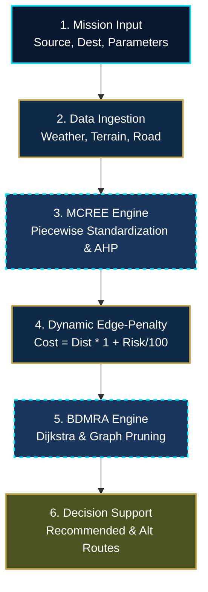
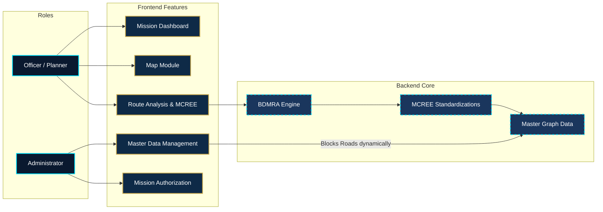

# BorderShield AI

## 🛡️ Project Overview
**BorderShield AI** is an advanced AI-driven Route Risk Prediction and Decision Support System designed for the Leh-Ladakh-Siachen sector. Traditional routing engines focus solely on physical distance or travel time, which is inadequate for high-stakes operational environments where safety is paramount. 

BorderShield AI evaluates highly dynamic operational datasets—including real-time weather conditions, challenging terrain topologies, and shifting road infrastructure metrics. By quantifying these multi-dimensional risks and fusing them with traditional graph theory algorithms, the system recommends paths that prioritize both operational safety and efficiency.

---

## ⚙️ System Flow & Architecture

The backend architecture is strictly aligned with the frozen project documentation (`Standardizarion Doc.txt`, `BDMRA1.txt`, `BDMRA2.txt`) to maintain mathematical integrity across all routing calculations.

### Step-by-Step System Flow:

1. **Mission Input**: The user selects a Source Node, Destination Node, and specifies mission parameters.
2. **Data Ingestion**: The system queries real-time master datasets (Weather, Terrain, Road Infrastructure) for every possible road segment (edge) in the geographical graph.
3. **MCREE (Multi-Criteria Risk Evaluation Engine)**: 
   - Converts raw environmental data into standardized `0-100` risk scores.
   - Utilizes mathematically sound **Piecewise Mapping Functions** based on scientific thresholds (e.g., Temperature, Elevation, Snowfall, Avalanche Risk).
   - Aggregates the standardized parameters using frozen **Analytical Hierarchy Process (AHP)** weights.
4. **Dynamic Edge-Penalty Method**: 
   - Converts the physical distance and MCREE Operational Risk into a unified "Dynamic Operational Cost".
   - **Formula**: `Cost = Distance * (1 + (OperationalRisk / 100))`. This ensures the algorithm heavily penalizes high-risk paths, prioritizing safety over sheer distance.
5. **BDMRA (BorderShield Dynamic Multi-Criteria Routing Algorithm)**: 
   - Executes a **Standard Dijkstra Shortest-Path Algorithm** over the dynamically weighted graph.
   - Iterates to compute primary and safe alternative routes by excluding bottleneck edges.
6. **Decision Support & Output**: 
   - Presents a deep analytical breakdown to the Officer, highlighting why a specific route was chosen and allowing for PDF report generation.

---

## 🧑‍✈️ Role-Based Architecture & Features

The platform operates across two distinct access levels, ensuring a secure and structured operational environment.

### 1. MISSION PLANNER (OFFICER)
The primary operator responsible for planning logistics and executing missions safely.
* **Planner Dashboard**: A high-level visual overview of ongoing active missions and system-wide operational alerts.
* **Operational Map**: An interactive, full-screen map interface (React-Leaflet) visualizing all strategic nodes (Bases, Checkposts, Relief Posts) and routing vectors.
* **Mission Creation & Route Analysis**: The core decision engine interface. Officers submit mission requirements and receive data-rich route recommendations (Output of MCREE & BDMRA). Officers can compare the recommended path against computed alternatives.
* **Mission Reporting**: A printable, formatted tactical summary for offline field deployment.

### 2. ADMINISTRATOR (ADMIN)
The overseer responsible for system health, infrastructure monitoring, and high-risk mission authorization.
* **Admin Dashboard**: Comprehensive command center displaying total active personnel, critical threshold alerts, and overall system logs.
* **Master Data Management**: Enables real-time modification of operational road statuses (OPEN, RESTRICTED, BLOCKED).
  - *Architectural Impact*: If an admin marks a road as `BLOCKED`, the system instantly prunes that edge from the BDMRA adjacency list, forcing all future Dijkstra calculations to route completely around the hazard.
* **Mission Authorization**: A secure queue for reviewing high-priority missions that exceed standard safety thresholds, requiring manual Admin sign-off before proceeding.
* **System Logs**: An immutable chronological audit trail tracking all critical system modifications.

---

## 🛠️ Technology Stack
* **Frontend Framework**: React.js powered by Vite
* **Routing**: React Router DOM
* **Map Engine**: React-Leaflet mapping OpenStreetMap tiles
* **Styling**: Pure custom CSS variables with a unified dark-mode "CID-tactical" aesthetic (Navy Blue, Cyan, Gold).
* **Algorithms**: Functional JavaScript implementing Graph Theory, Priority Queues, and mathematical Piecewise mappings natively.
